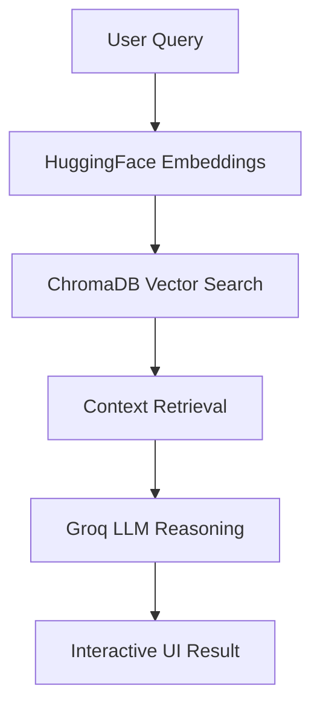

# 🎬 Agentic RAG Anime Recommender System

[](https://appudtzei3tyyttd6xjhwur.streamlit.app/)
[](https://opensource.org/licenses/MIT)
[](https://github.com/Ratnesh-181998/Agentic-RAG-Anime-Recommender-System)
[](https://www.linkedin.com/in/ratneshkumar1998/)

> **A production-grade, Agentic Retrieval-Augmented Generation (RAG) system for semantic anime discovery. Powered by Groq, LangChain, and ChromaDB.**

### 🏷️ Core Technologies & Keywords

| Category | Keywords & Skills |
| :--- | :--- |
| **🤖 AI/ML** |      |
| **🛠️ Tech Stack** |       |
| **☁️ DevOps/Infra** |       |
| **🎯 Domain** |    |

---

## 🌟 Overview

The **Agentic RAG Anime Recommender** is an advanced AI platform that moves beyond traditional keyword-based search. It understands the **semantic nuance**, **emotional tone**, and **thematic depth** of user preferences to provide high-fidelity recommendations. 

By leveraging the speed of **Groq LPUs** and the precision of **ChromaDB**, this system delivers sub-second inferences with a reasoning layer that explains *why* a specific anime matches your "vibe."

---

## 🚀 Key Features

- **🧠 Semantic Vibe Search**: Search for anime using complex descriptions like *"A dark psychological thriller with mind games and a somber atmosphere."*
- **⚡ Ultra-Fast Inference**: Integrated with **Groq Engine** for near-instant response generation.
- **🛡️ Hybrid Reasoning**: Combines vector similarity (retrieval) with LLM reasoning (agentic) for accurate results.
- **📊 Real-Time Operations**: Live tracking of system metrics, logs, and retrieval status.
- **🎨 Premium UI**: A highly interactive, dark-themed Streamlit dashboard with custom CSS animations.
- **📦 Cloud Native**: Fully containerized with Docker and ready for Kubernetes orchestration.

---

## 🛠️ Technology Stack

| Category | Technology | Purpose |
| :--- | :--- | :--- |
| **AI & Intelligence** |    | Agentic Reasoning & RAG Orchestration |
| **Embeddings & Vector** |   | Semantic Search & Data Retrieval |
| **Frontend & UI** |    | Premium Dashboard & User Experience |
| **Data & Analytics** |    | Data Wrangling & Processing |
| **Infrastructure** |     | Scalable Deployment & Cloud Hosting |
| **Observability** |   | CI/CD & Performance Monitoring |

---

## 🏗️ Architecture Design

The system follows a modern **RAG (Retrieval-Augmented Generation)** architecture:

1.  **Data Ingestion**: Raw anime metadata is preprocessed and converted into 384-dimensional vectors.
2.  **Indexing**: Vectors are stored in a **ChromaDB** collection for efficient retrieval.
3.  **Retrieval**: User queries are embedded in real-time to find top-K semantic matches.
4.  **Agentic Reasoning**: Retreived anime metadata is passed to **Groq LLM** via a custom prompt template.
5.  **Output**: The system generates a structured recommendation with reasoning.

### 📊 System Workflow


---

## 📱 User Interface Sections

### 1. 🎮 Demo Project Tab
*   **The Search Core**: A natural language input box for "vibe-based" queries.
*   **Quick Try Presets**: 16 categorized buttons (e.g., "Dark Fantasy", "Cyberpunk") for instant exploration.
*   **Interactive History**: Persistent search logs within the session with download options.

### 2. 📖 About Project Tab
*   **Project Vision**: High-level motivation and problem-solution framework.
*   **Technical Pipeline**: Detailed breakdown of the Intelligence, Retrieval, and Infrastructure layers.
*   **How it Works**: Step-by-step technical flow from query to output.

### 3. 🔧 Tech Stack Tab
*   **Live Metrics**: Pulse monitor showing LLM latency and Vector DB status.
*   **Rationale**: Interactive "Why We Chose" sections for each component in the stack.
*   **Benchmarking**: Detailed system performance metrics and scalability targets.

### 4. 🏗️ Architecture Tab
*   **Blueprints**: Access to High-Level (HLD) and Low-Level (LLD) design diagrams.
*   **Phase Mapping**: Detailed breakdown of Ingestion, Reasoning, and Deployment phases.
*   **Interaction Maps**: Component-to-component communication protocols.

### 5. 📋 System Logs Tab
*   **Event Stream**: Real-time logging of application activity.
*   **Log Filtering**: Multiselect filters (INFO, SUCCESS, ERROR) to debug the system.
*   **Breakdown Analytics**: Statistical visualization of system events.

---

## 🚀 Deployment & CI/CD Pipeline

### 🏗️ CI/CD with GitHub Actions
- **Continuous Integration**: Automated linting and unit tests on every PR.
- **Continuous Deployment**: Docker images automatically built and pushed to Container Registry (GCR/ECR).

### ☁️ Deployment Steps

#### **Streamlit Cloud**
1. Connect your GitHub repository to [Streamlit Cloud](https://share.streamlit.io/).
2. Set the main file path to `app/premium_dashboard.py`.
3. Add API keys (`GROQ_API_KEY`) to the Secrets management.

#### **Google Cloud Platform (GCP - GKE)**
1. Build & Push Docker image: `docker build -t gcr.io/[PROJECT_ID]/anime-recommender .`
2. Deploy to Kubernetes: `kubectl apply -f k8s/deployment.yaml`
3. Expose via LoadBalancer: `kubectl apply -f k8s/service.yaml`

#### **Amazon Web Services (AWS - EKS)**
1. Authenticate with ECR and push the container.
2. Create EKS Cluster using `eksctl`.
3. Deploy components using **Helm Charts** for scalability.

---

## 🛠️ Development & Local Setup

### 📦 Prerequisites
- Python 3.11+
- [Git LFS](https://git-lfs.com/) (Required for large model/data files up to 2GB)
- Groq API Key

### 🚀 Installation
```bash
# 1. Clone the repository
git clone https://github.com/Ratnesh-181998/Agentic-RAG-Anime-Recommender-System.git
cd Agentic-RAG-Anime-Recommender-System

# 2. Install Git LFS and pull large files
git lfs install
git lfs pull

# 3. Create virtual environment
python -m venv venv
source venv/bin/activate  # On Windows: venv\Scripts\activate

# 4. Install dependencies
pip install -r requirements.txt

# 5. Set up Environment Variables
# Create a .env file and add your GROQ_API_KEY
echo "GROQ_API_KEY=your_key_here" > .env

# 6. Run the Application
streamlit run app/premium_dashboard.py
```

---

## 🗃️ Git LFS Configuration
This project uses **Git Large File Storage (LFS)** to manage large datasets and embedding models efficiently.
```bash
git lfs track "*.csv"
git lfs track "*.bin"
git lfs track "*.pkl"
git lfs track "*.png"
```

---

## 📞 Contact

**Ratnesh Kumar Singh | Data Scientist (AI/ML Engineer 4+ Yrs Experience)**

- 💼 **LinkedIn**: [https://www.linkedin.com/in/ratneshkumar1998/](https://www.linkedin.com/in/ratneshkumar1998/)
- 🐙 **GitHub**: [https://github.com/Ratnesh-181998](https://github.com/Ratnesh-181998)

### Project Links
- 🌐 **Live Demo**: [Streamlit App](https://appudtzei3tyyttd6xjhwur.streamlit.app/)
- 📖 **Documentation**: [GitHub Wiki](https://github.com/Ratnesh-181998/Agentic-RAG-Anime-Recommender-System/wiki)
- 🐛 **Issue Tracker**: [GitHub Issues](https://github.com/Ratnesh-181998/Agentic-RAG-Anime-Recommender-System/issues)
- 💬 **Discussions**: [GitHub Discussions](https://github.com/Ratnesh-181998/Agentic-RAG-Anime-Recommender-System/discussions)

---

## 📜 License
This project is licensed under the **MIT License** - see the [LICENSE](LICENSE) file for details.

---
*Built with ❤️ for the Anime & AI Community.*
