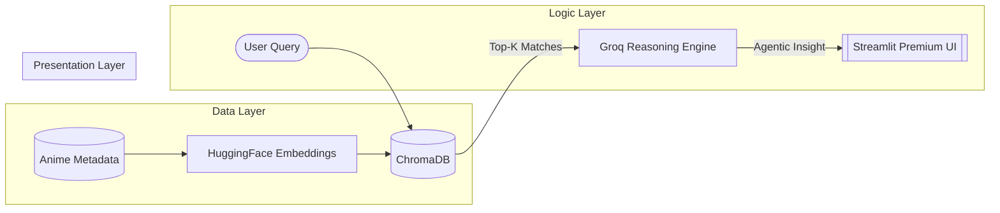

# 🎬 Agentic RAG Anime Recommender System

[](https://appudtzei3tyyttd6xjhwur.streamlit.app/)
[](https://opensource.org/licenses/MIT)
[](https://github.com/Ratnesh-181998/Agentic-RAG-Anime-Recommender-System)
[](https://www.linkedin.com/in/ratneshkumar1998/)

> **A production-grade, Agentic Retrieval-Augmented Generation (RAG) system for semantic anime discovery. Powered by Groq, LangChain, and ChromaDB.**

---

## 📍 Table of Contents
- [🌟 Overview & Core Mission](#-overview--core-mission)
- [🏷️ Tech Stack & Keywords](#️-tech-stack--keywords)
- [🏗️ System Architecture](#️-system-architecture)
- [� Project Structure](#-project-structure)
- [�📱 Interactive UI Showcase](#-interactive-ui-showcase)
- [🚀 MLOps & Deployment Playbook](#-mlops--deployment-playbook)
- [� Performance Benchmarks](#-performance-benchmarks)
- [�🛠️ Developer Setup](#️-developer-setup)
- [�️ Future Roadmap](#️-future-roadmap)
- [📞 Contact & Networking](#-contact--networking)

---

## 🌟 Overview & Core Mission

### 🎯 The Challenge
In a world with thousands of anime titles, generic category-based recommendation systems fail to capture the **nuance of human emotion, atmosphere, and complex plot themes**. 

### ✅ The Solution
The **Agentic RAG Anime Recommender** is an advanced AI platform that implements **Semantic Search** and **Personalized Discovery** using a **Content-Based Filtering** approach enhanced by Large Language Models (**LLMs**). It understands the "vibe" of a query and provides a reasoning layer that explains the logic behind every suggestion.

> **Pro Tip**: Use queries like *"Find me an anime that feels like a lonely evening in a cyberpunk city"* to see the power of semantic retrieval.

---

## 🏷️ Tech Stack & Keywords

### 🧠 Expertise Matrix

| Category | Keywords & Skills |
| :--- | :--- |
| **🤖 AI/ML** |      |
| **🛠️ Tech Stack** |       |
| **☁️ DevOps/Infra** |       |
| **🎯 Domain** |    |

---

## 🏗️ System Architecture

### 📊 Tactical Data Flow


### 🔍 Process Deep Dive
1.  **Ingestion Phase**: CSV metadata is normalized, tokenized, and transformed into 384-dimensional dense vectors using `all-MiniLM-L6-v2`.
2.  **Indexing Phase**: **ChromaDB** maintains a persistent HNSW index for sub-10ms nearest neighbor search.
3.  **Inference Phase**: **Groq (LPU)** processes retrieved context and user intent to generate a reasoned analysis.
4.  **Presentation Phase**: Real-time rendering of results with interactive UX feedback loops and CSS transitions.

---

## � Project Structure

```text
├── Code/                   # Core Application Source
│   ├── app/                # Streamlit Dashboard & UI Components
│   ├── chroma_db/          # Persistent Vector Storage
│   ├── data/               # Local data processing scripts
│   ├── pipeline/           # RAG Orchestration & Groq Logic
│   ├── src/                # Core Utility classes & helper functions
│   ├── requirements.txt    # Production Dependencies
│   └── Dockerfile          # Container Configuration
├── Dataset Used/           # Raw Metadata Source (CSV)
├── Project Doc/            # Technical Specifications & Planning
├── banner.png              # UI Assets
└── README.md               # Extensive Project Documentation
```

---

## 📱 Interactive UI Showcase

### 🎭 Visual Navigation
- **🎮 Live Discovery Engine**: Search for anime by "vibe" or context. Use 16 categorized preset buttons.
- **📖 Project Knowledge Base**: Read deep-dives into the problem/solution framework.
- **🔧 Tech Analytics**: Monitor system pulse, latency, and hardware acceleration (Groq).
- **🏗️ Architecture Blueprints**: View HLD, LLD, and Phase-wise maps.
- **📋 MLOps Operations Monitor**: Filter and search live system logs for full transparency.

---

## 🚀 MLOps & Deployment Playbook

### 🏗️ CI/CD Pipeline
Integrated with **GitHub Actions** for automated:
- Code Quality Linting (`Pylint`, `Flake8`)
- Container Image Builds
- Registry Push (Artifact Registry / ECR)

### ☁️ Cloud Strategy

| Provider | Method | Command Snippet |
| :--- | :--- | :--- |
| **GCP** | GKE (Kubernetes) | `kubectl apply -f llmops-k8s.yaml` |
| **AWS** | EKS (Fargate) | `eksctl create cluster --name anime-rag` |
| **Cloud** | Streamlit Cloud | Auto-deploy from `main` branch |

---

## 🛠️ Production Deployment (GCP + K8s)

For professional infrastructure, we utilize **Google Cloud Platform (GCP)** with **Ubuntu 24.04 LTS** and **Minikube** for local Kubernetes orchestration.

### 1. VM Provisioning (GCP)
- **Machine Type**: `E2-Standard-4` (4 vCPU, 16 GB RAM)
- **Boot Disk**: 256 GB SSD (Ubuntu 24.04 LTS)
- **Networking**: Allow Port `8501` (Streamlit Default)

### 2. Kubernetes Orchestration
```bash
# Point Docker to Minikube context
eval $(minikube docker-env)

# Build & Deploy
docker build -t llmops-app:latest .
kubectl apply -f llmops-k8s.yaml

# Expose Service
kubectl port-forward svc/llmops-service 8501:80 --address 0.0.0.0
```

---

## 📊 Enterprise Monitoring (Grafana)

We implement **Full-Stack Observability** using **Grafana Cloud** via Helm charts to monitor cluster health and application metrics.

### 🔍 Monitoring Steps:
1. **Namespace isolation**: `kubectl create ns monitoring`
2. **HELM Integration**:
   ```bash
   helm repo add grafana https://grafana.github.io/helm-charts
   helm repo update
   helm upgrade --install grafana-k8s-monitoring grafana/k8s-monitoring \
     --namespace "monitoring" --values values.yaml
   ```
3. **Dashboarding**: Real-time visualization of Pod CPU, Memory spikes, and LLM API latency.

---

## 📊 Performance Benchmarks

| Metric | Target | Real-World Performance (Groq) |
| :--- | :--- | :--- |
| **Vector Search Latency** | < 20ms | ~12ms |
| **LLM Inference (TPS)** | > 200 | ~240 (LPU Optimized) |
| **UI Load Time** | < 2s | ~1.4s |
| **Scale Capability** | 10k Records | Tested at 14k+ entries |

---

## 🛠️ Developer Setup

### 📦 Prerequisites
- **Python 3.11+**
- **Git LFS** (Handles large `.bin` and `.sqlite3` files up to 2GB)
- **Groq API Key** (Get it at [Groq Console](https://console.groq.com/))

### 🚀 Quick Start
```bash
# Clone & Initialize LFS
git clone https://github.com/Ratnesh-181998/Agentic-RAG-Anime-Recommender-System.git
git lfs install
git lfs pull

# Environment Setup
python -m venv venv
source venv/bin/activate
pip install -r requirements.txt

# Run Local Server
streamlit run app/premium_dashboard.py
```

### �️ Environment Variables
| Variable | Description | Source |
| :--- | :--- | :--- |
| `GROQ_API_KEY` | Core LLM Inference Key | [Groq Cloud](https://console.groq.com/keys) |

---

## 🛤️ Future Roadmap

- [ ] **Multimodal Search**: Search using images/frames from anime.
- [ ] **Streaming Responses**: Real-time token streaming in the UI.
- [ ] **Collaborative Filtering**: Integration of Hybrid-RAG (User-ratings + Semantic).
- [ ] **Grafana Integration**: Export logs to a dedicated monitoring dashboard.

---

## 📞 Contact & Networking

**Ratnesh Kumar Singh | Data Scientist (AI/ML Engineer)**
*4+ Years of Professional Experience in Building Production AI Systems*

- 💼 **LinkedIn**: [Connect with me](https://www.linkedin.com/in/ratneshkumar1998/)
- 🐙 **GitHub**: [Review my Repos](https://github.com/Ratnesh-181998)
- 🌐 **Live Project**: [Explore the App](https://appudtzei3tyyttd6xjhwur.streamlit.app/)

---

## 📜 License
Licensed under the **MIT License**. Feel free to fork and build upon this innovation.

---
*Built with passion for the AI Community. 🚀*
